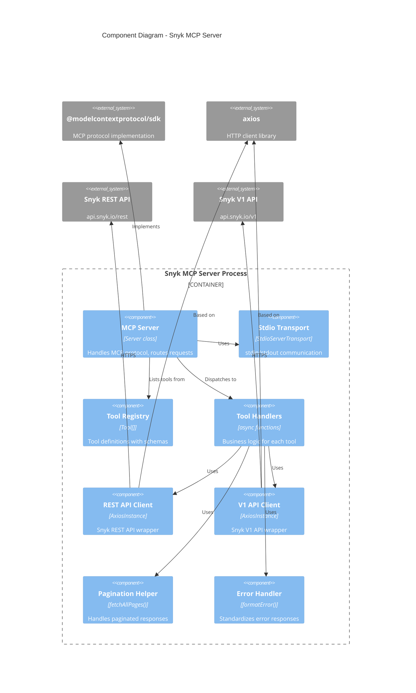
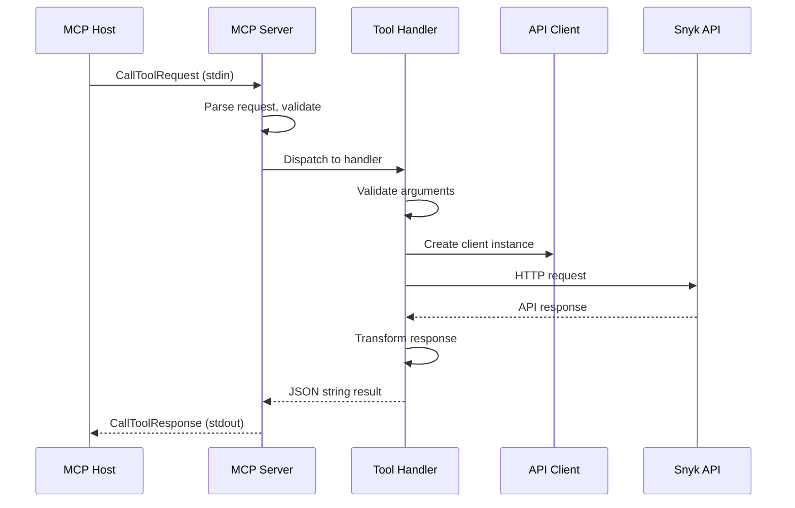
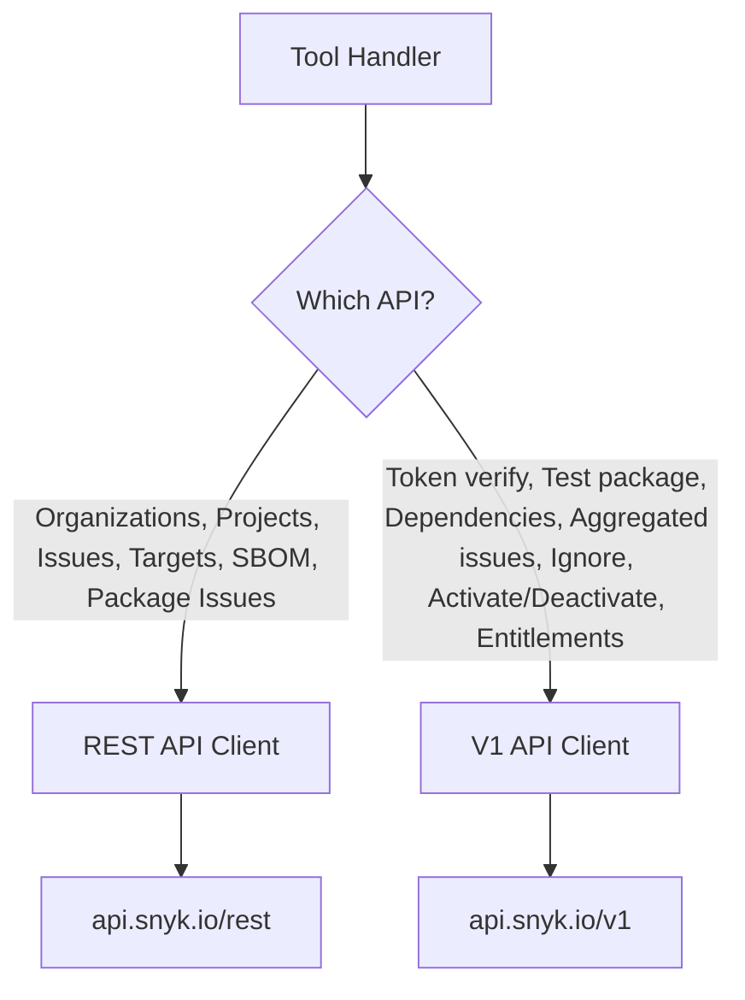

# Component Diagram - C4 Level 3

## Overview

This document details the internal structure of the Snyk MCP Server, showing the key components, their responsibilities, and interactions within the Node.js process.

## Component Diagram



## Component Details

### MCP Server

**File**: `src/index.ts` (lines 1113-1124)

```typescript
const server = new Server(
  { name: "snyk-mcp", version: "1.0.0" },
  { capabilities: { tools: {} } }
);
```

| Responsibility | Description |
|---------------|-------------|
| Protocol handling | Implements MCP JSON-RPC protocol |
| Request routing | Maps tool names to handlers |
| Response formatting | Wraps results in MCP response format |
| Lifecycle management | Starts/stops server |

### Stdio Transport

**File**: `src/index.ts` (lines 1256-1257)

```typescript
const transport = new StdioServerTransport();
await server.connect(transport);
```

| Responsibility | Description |
|---------------|-------------|
| Input parsing | Reads JSON-RPC from stdin |
| Output writing | Writes JSON-RPC to stdout |
| Buffering | Handles message boundaries |

### Tool Registry

**File**: `src/index.ts` (lines 186-558)

The tool registry is a static array of 17 tool definitions:

| Category | Tools |
|----------|-------|
| Auth | `snyk_verify_token` |
| Organizations | `snyk_list_orgs`, `snyk_get_org`, `snyk_get_org_entitlements` |
| Projects | `snyk_list_projects`, `snyk_get_project`, `snyk_activate_project`, `snyk_deactivate_project` |
| Issues | `snyk_list_issues`, `snyk_get_issue`, `snyk_get_project_aggregated_issues`, `snyk_ignore_issue` |
| Dependencies | `snyk_list_dependencies`, `snyk_test_package`, `snyk_list_package_issues` |
| SBOM | `snyk_get_sbom` |
| Targets | `snyk_list_targets` |

Each tool definition includes:
- `name`: Unique tool identifier
- `description`: Natural language description
- `inputSchema`: JSON Schema for arguments

### Tool Handlers

**File**: `src/index.ts` (lines 561-1110)

Each tool has a dedicated async handler function:

```typescript
async function handleListProjects(args: {...}): Promise<string>
async function handleGetIssue(args: {...}): Promise<string>
// ... etc
```

| Pattern | Description |
|---------|-------------|
| Input validation | Check required args, use defaults |
| Client selection | Choose REST or V1 API |
| API call | Make HTTP request |
| Response transformation | Map API response to simplified JSON |
| Error handling | Catch and format errors |

### REST API Client Factory

**File**: `src/index.ts` (lines 104-119)

```typescript
function createRestClient(): AxiosInstance {
  return axios.create({
    baseURL: "https://api.snyk.io/rest",
    headers: {
      "Authorization": `token ${SNYK_TOKEN}`,
      "Content-Type": "application/vnd.api+json",
    },
    params: { version: SNYK_API_VERSION },
  });
}
```

| Configuration | Value |
|--------------|-------|
| Base URL | `https://api.snyk.io/rest` |
| Auth | Token in Authorization header |
| Content-Type | `application/vnd.api+json` |
| Version | Query param (default: 2024-10-15) |

### V1 API Client Factory

**File**: `src/index.ts` (lines 121-133)

```typescript
function createV1Client(): AxiosInstance {
  return axios.create({
    baseURL: "https://api.snyk.io/v1",
    headers: {
      "Authorization": `token ${SNYK_TOKEN}`,
      "Content-Type": "application/json",
    },
  });
}
```

| Configuration | Value |
|--------------|-------|
| Base URL | `https://api.snyk.io/v1` |
| Auth | Token in Authorization header |
| Content-Type | `application/json` |

### Pagination Helper

**File**: `src/index.ts` (lines 136-161)

```typescript
async function fetchAllPages<T>(
  client: AxiosInstance,
  initialUrl: string,
  maxPages: number = 10
): Promise<T[]>
```

| Feature | Description |
|---------|-------------|
| Generic | Works with any paginated resource |
| Link following | Parses `links.next` from responses |
| Page limit | Configurable max pages (default: 10) |
| Accumulation | Concatenates all page results |

### Error Handler

**File**: `src/index.ts` (lines 164-183)

```typescript
function formatError(error: unknown): string
```

| Error Type | Handling |
|-----------|----------|
| Axios error | Extract status, error details from response |
| Standard Error | Use message property |
| Unknown | Convert to string |

## Component Interactions

### Tool Invocation Flow



### API Client Selection Logic



## Type System

### Key Interfaces

**File**: `src/index.ts` (lines 22-101)

```typescript
interface SnykOrg {
  id: string;
  attributes: { name: string; slug: string; ... };
}

interface SnykProject {
  id: string;
  attributes: { name: string; type: string; origin: string; ... };
}

interface SnykIssue {
  id: string;
  attributes: { title: string; severity: string; ... };
}

interface SnykTarget {
  id: string;
  attributes: { display_name: string; url?: string; ... };
}

interface PaginatedResponse<T> {
  data: T[];
  links?: { next?: string; ... };
}
```

## Code Metrics

| Metric | Value |
|--------|-------|
| Total lines | 1266 |
| Tools defined | 17 |
| Handler functions | 17 |
| Interfaces | 5 |
| Helper functions | 4 |
| Dependencies | 2 (axios, @modelcontextprotocol/sdk) |

## Open Questions and Gaps

1. **Code Organization**: All code in single file; could benefit from modular structure
2. **Type Safety**: Some `Record<string, unknown>` types could be more specific
3. **Input Validation**: Schema validation relies on caller; no runtime validation
4. **Logging**: Only stderr for startup; no structured logging
5. **Configuration**: No config file support; environment only
6. **Extensibility**: Adding tools requires modifying single file
