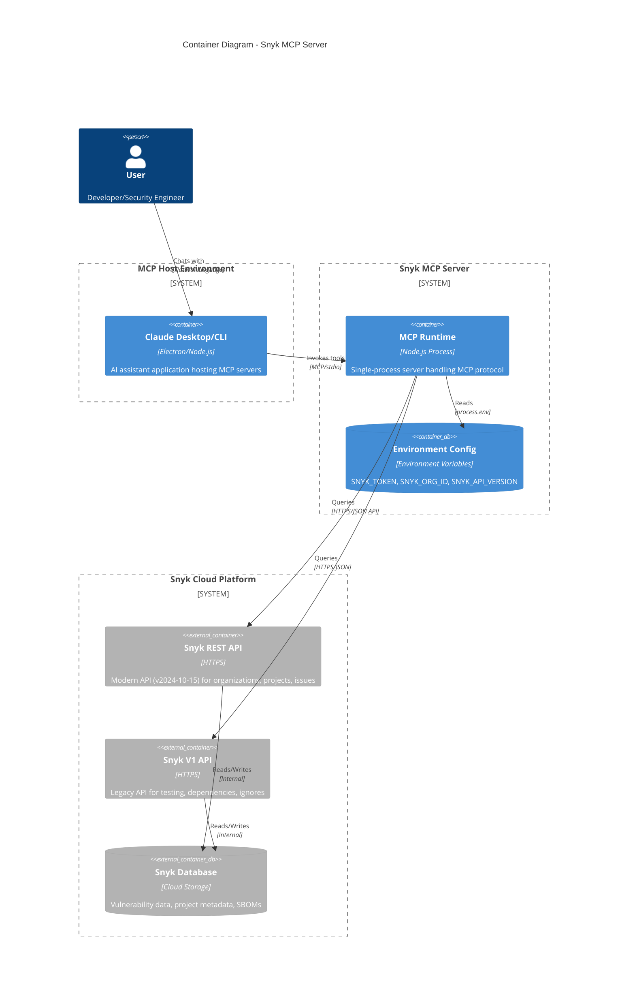

# Container Diagram - C4 Level 2

## Overview

This document describes the major building blocks of the Snyk MCP Server system. At this level, we identify the runtime containers, their responsibilities, and inter-container communication.

## Container Diagram



## Container Descriptions

### MCP Runtime (Node.js Process)

**Purpose**: Core runtime executing the MCP server logic

| Aspect | Details |
|--------|---------|
| Technology | Node.js (ES2022 modules) |
| Entry Point | `dist/index.js` |
| Transport | stdio (stdin/stdout) |
| State | Stateless |
| Lifecycle | Spawned by MCP host on demand |

**Responsibilities**:
- Parse MCP protocol messages from stdin
- Validate and route tool requests
- Execute API calls to Snyk
- Format and return responses via stdout

### Environment Configuration

**Purpose**: Runtime configuration via environment variables

| Variable | Required | Purpose |
|----------|----------|---------|
| `SNYK_TOKEN` | Yes | API authentication token |
| `SNYK_ORG_ID` | No | Default organization ID |
| `SNYK_API_VERSION` | No | API version (default: 2024-10-15) |

### Snyk REST API

**Purpose**: Modern Snyk API for core operations

| Aspect | Details |
|--------|---------|
| Base URL | `https://api.snyk.io/rest` |
| Authentication | Bearer token |
| Content-Type | `application/vnd.api+json` |
| Versioning | Query parameter (`version=2024-10-15`) |

**Operations**:
- List/Get organizations
- List/Get/Activate/Deactivate projects
- List/Get issues
- List targets
- Get SBOM
- List package issues

### Snyk V1 API

**Purpose**: Legacy API for features not yet in REST API

| Aspect | Details |
|--------|---------|
| Base URL | `https://api.snyk.io/v1` |
| Authentication | Token header |
| Content-Type | `application/json` |

**Operations**:
- Verify token / Get user info
- Test packages for vulnerabilities
- Get aggregated project issues
- List dependencies
- Ignore issues
- Get organization entitlements

## Runtime Characteristics

### Process Model

```
[Claude Desktop] --spawn--> [Node.js Process: snyk-mcp]
                      |
                      +--> [Axios HTTP Client] --HTTPS--> [Snyk APIs]
```

- **Single Process**: One Node.js process per MCP server instance
- **On-Demand**: Process spawned when AI assistant needs Snyk tools
- **Short-Lived**: Process terminates when AI session ends or explicitly stopped

### Memory Model

| Component | Lifetime | Scope |
|-----------|----------|-------|
| Tool definitions | Process lifetime | Static array |
| Axios clients | Per-request | Created on tool invocation |
| API responses | Request scope | Garbage collected after response |

### Thread Model

- **Single-Threaded**: Node.js event loop
- **Async/Await**: Non-blocking I/O for API calls
- **No Workers**: No worker threads or child processes

## Communication Protocols

### MCP Protocol (Inbound)

```
stdin --> JSON-RPC messages --> Tool invocation
stdout <-- JSON-RPC responses <-- Tool results
stderr <-- Diagnostic logs (startup, errors)
```

### HTTP Protocol (Outbound)

```
MCP Server --> HTTPS --> Snyk REST API
           --> HTTPS --> Snyk V1 API
```

- TLS 1.2+ required
- Connection pooling via Axios defaults
- No connection keep-alive configuration

## Scalability Considerations

| Aspect | Current State | Limitation |
|--------|---------------|------------|
| Instances | Single | Per MCP host session |
| Concurrent requests | Sequential | Single-threaded processing |
| API throughput | Rate-limited | Snyk API quotas apply |
| Memory | ~50-100MB | Node.js baseline |

## Open Questions and Gaps

1. **Connection Pooling**: No explicit HTTP connection pool configuration
2. **Request Timeout**: No explicit timeout configuration for API calls
3. **Circuit Breaker**: No resilience patterns for API failures
4. **Caching**: No response caching for repeated queries
5. **Health Check**: No built-in health check endpoint
