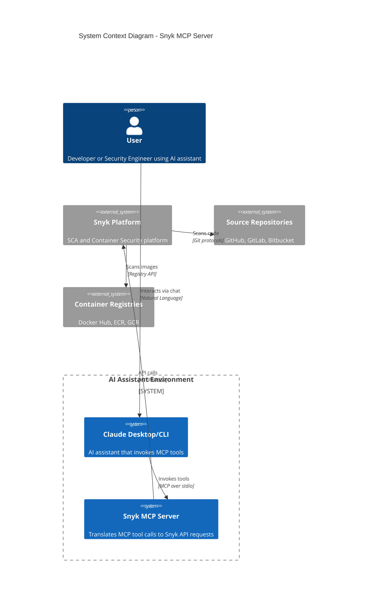

# System Context - C4 Level 1

## Overview

The Snyk MCP Server acts as an integration bridge between AI assistants and the Snyk security platform. It translates natural language-driven tool requests from AI systems into Snyk API calls, enabling automated security workflows.

## System Context Diagram



## Actors and Systems

### Primary Actors

| Actor | Role | Interaction |
|-------|------|-------------|
| Developer | Uses AI assistant to query security status | Natural language queries |
| Security Engineer | Manages vulnerabilities and policies | Tool invocations via AI |
| DevSecOps | Automates security workflows | Batch operations |

### External Systems

| System | Purpose | Integration Type |
|--------|---------|------------------|
| Snyk REST API | Modern API for orgs, projects, issues | HTTPS (v2024-10-15) |
| Snyk V1 API | Legacy API for specific features | HTTPS |
| Claude Desktop | AI assistant host | MCP stdio transport |
| Source Control | Code repositories monitored by Snyk | Via Snyk integration |
| Container Registries | Container images scanned by Snyk | Via Snyk integration |

## Communication Patterns

### Inbound

```
User -> Claude Desktop -> (stdio) -> Snyk MCP Server
```

The MCP Server receives tool invocation requests via stdio from the AI assistant host. Each request contains:
- Tool name (e.g., `snyk_list_projects`)
- Arguments object (JSON)

### Outbound

```
Snyk MCP Server -> (HTTPS) -> Snyk REST API
Snyk MCP Server -> (HTTPS) -> Snyk V1 API
```

The server makes authenticated HTTPS requests to Snyk APIs using token-based authentication.

## Context Boundaries

### Trust Boundaries

1. **AI Assistant Boundary**: The MCP server trusts the host process (Claude Desktop) to properly authenticate users
2. **Network Boundary**: All external API communication is over HTTPS
3. **Snyk API Boundary**: API token provides access control to Snyk resources

### Data Boundaries

1. **Configuration Data**: Environment variables for secrets (SNYK_TOKEN, SNYK_ORG_ID)
2. **Request Data**: Tool arguments flow from AI to MCP server
3. **Response Data**: API responses flow from Snyk to AI

## Key Constraints

| Constraint | Description | Impact |
|------------|-------------|--------|
| Stateless Design | Server maintains no persistent state | Each request is independent |
| Single Token | One API token per server instance | Organization scope limitation |
| Rate Limits | Snyk API rate limits apply | 1620-2000 req/min depending on API |
| Network Dependency | Requires internet connectivity | No offline operation |

## Integration Points

### Required Integrations

1. **MCP Host**: Any MCP-compatible AI assistant (Claude Desktop, Claude CLI)
2. **Snyk Account**: Active Snyk account with API token

### Optional Integrations

1. **Default Organization**: Pre-configured org ID for convenience
2. **API Version Override**: Custom API version selection

## Open Questions and Gaps

1. **Multi-Organization**: Currently supports single default org; multi-org workflows require per-call org_id
2. **Snyk Groups**: Group-level operations not implemented
3. **Webhooks**: No support for Snyk webhooks or event-driven patterns
4. **SSO Integration**: Relies on API tokens; no direct SSO support
