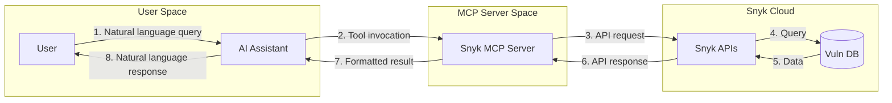
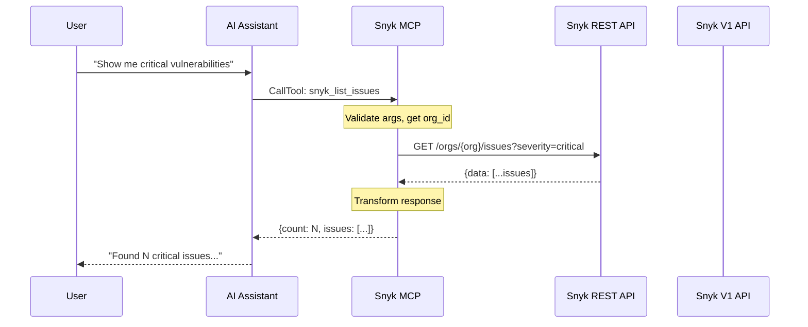
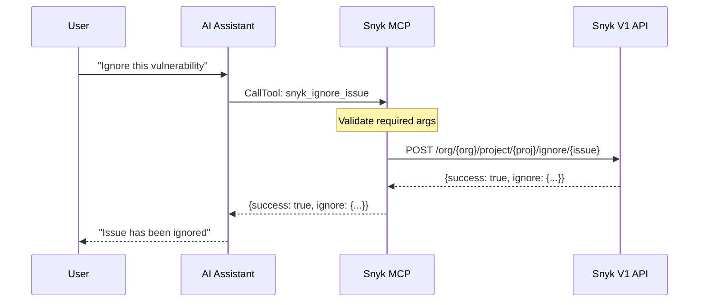
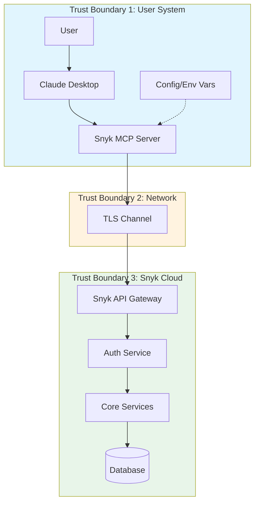
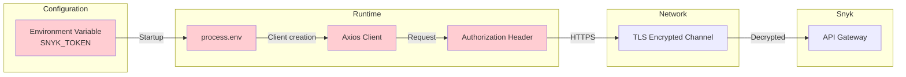
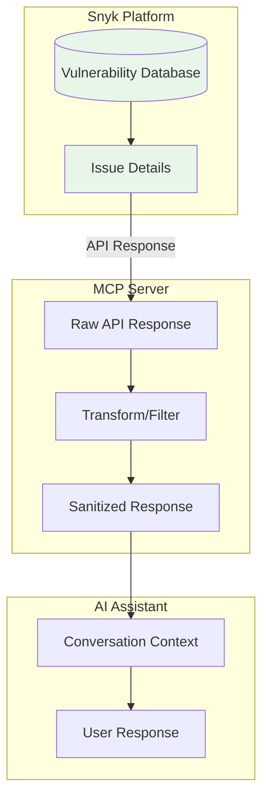
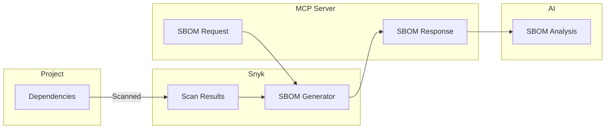
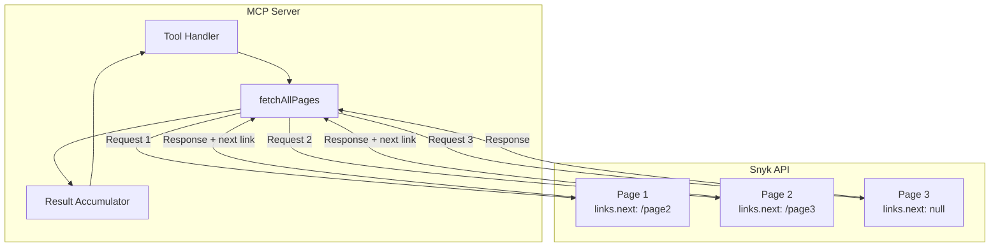

# Data Flow Diagrams

## Overview

This document describes how data flows through the Snyk MCP Server, including trust boundaries, data transformations, and sensitive data handling.

## High-Level Data Flow



## Data Flow by Operation Type

### Query Operations (Read)



### Mutation Operations (Write)



## Trust Boundaries



### Trust Boundary Analysis

| Boundary | Trust Level | Data Crossing | Controls |
|----------|-------------|---------------|----------|
| User <-> AI | High | Natural language | User authentication to Claude |
| AI <-> MCP | High | Tool calls, results | Process isolation |
| MCP <-> Network | Medium | API requests | TLS encryption |
| Network <-> Snyk | High | Authenticated requests | Token validation |

## Sensitive Data Paths

### API Token Flow



**Security Controls**:
- Token never logged to stdout/stderr
- Token stored only in memory at runtime
- TLS encrypts token in transit
- Token not included in error messages

### Vulnerability Data Flow



### SBOM Data Flow



## Data Transformations

### Input Transformation

| Stage | Data Format | Example |
|-------|-------------|---------|
| User input | Natural language | "List critical bugs" |
| AI interpretation | Tool call JSON | `{tool: "snyk_list_issues", args: {severity: ["critical"]}}` |
| MCP parsing | Typed arguments | `{effective_severity_level: ["critical"]}` |
| API request | Query params | `?effective_severity_level=critical` |

### Output Transformation

| Stage | Data Format | Example |
|-------|-------------|---------|
| API response | JSON API format | `{data: [{id: "...", attributes: {...}}]}` |
| MCP transform | Simplified JSON | `{issues: [{id: "...", title: "...", severity: "..."}]}` |
| AI formatting | Natural language | "Found 3 critical issues: ..." |

### Transformation Example

**API Response** (before):
```json
{
  "data": [{
    "id": "issue-123",
    "type": "issue",
    "attributes": {
      "title": "SQL Injection",
      "effective_severity_level": "critical",
      "status": "open",
      "ignored": false,
      "problems": [...]
    }
  }]
}
```

**MCP Response** (after):
```json
{
  "count": 1,
  "issues": [{
    "id": "issue-123",
    "title": "SQL Injection",
    "severity": "critical",
    "status": "open",
    "ignored": false
  }]
}
```

## Data Retention

| Data Type | Retention in MCP | Storage Location |
|-----------|------------------|------------------|
| API Token | Process lifetime | Memory only |
| Request args | Request scope | Memory, garbage collected |
| API responses | Request scope | Memory, garbage collected |
| Error messages | Transient | stderr |

## Data Classification

| Data Type | Classification | Handling |
|-----------|---------------|----------|
| API Token | Secret | Never log, encrypt in transit |
| Organization ID | Internal | May appear in logs |
| Project names | Internal | May appear in responses |
| Vulnerability details | Confidential | Return to authorized user only |
| SBOM data | Confidential | Contains dependency inventory |
| User info (verify_token) | PII | Limited to current user |

## Pagination Data Flow



## Open Questions and Gaps

1. **Data Masking**: No automatic masking of sensitive fields in responses
2. **Audit Logging**: No audit trail of data access
3. **Data Encryption**: No at-rest encryption (memory only)
4. **Rate Limit Visibility**: Rate limit headers not exposed to caller
5. **Response Size Limits**: Large SBOMs could cause memory issues
6. **PII Handling**: User email from verify_token not specially handled
