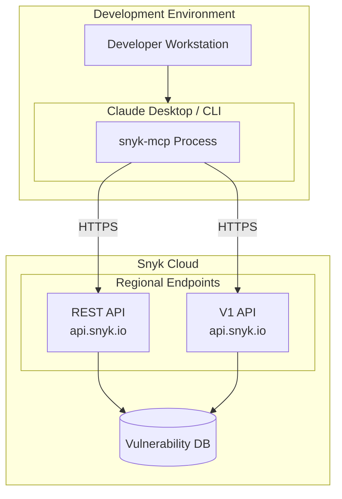
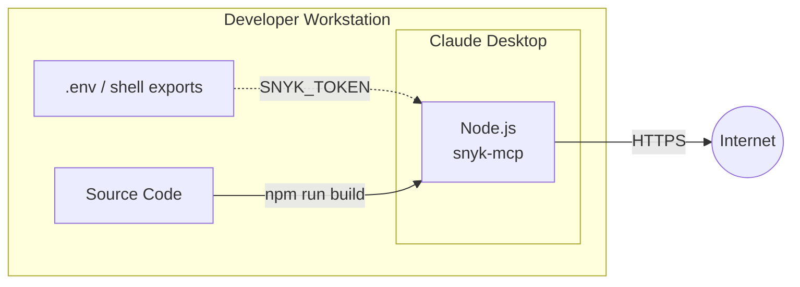
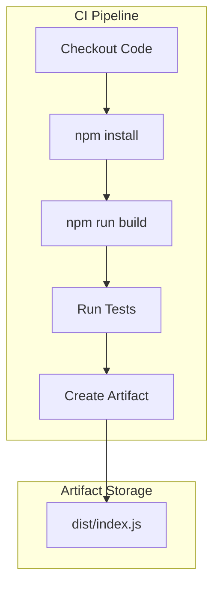
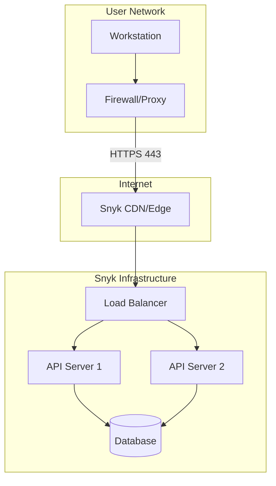

# Deployment Architecture

## Overview

The Snyk MCP Server is designed as a lightweight, embeddable process that runs alongside an MCP-compatible host application. This document describes deployment patterns, environment configurations, and infrastructure considerations.

## Deployment Diagram



## Environment Configurations

### Local Development



**Configuration**:

| Aspect | Details |
|--------|---------|
| Node.js Version | 18+ recommended |
| Build | `npm run build` (TypeScript to JavaScript) |
| Run | `npm start` or invoked by Claude Desktop |
| Config Location | `~/.claude/.claude.json` |
| Token Storage | Environment variable |

**Claude Desktop Configuration**:
```json
{
  "mcpServers": {
    "snyk": {
      "command": "node",
      "args": ["/path/to/snyk-mcp/dist/index.js"],
      "env": {
        "SNYK_TOKEN": "snyk_token_here",
        "SNYK_ORG_ID": "org_id_here"
      }
    }
  }
}
```

### CI/CD Integration (Assumption)

> **Note**: No CI/CD configuration exists in the repository. This section describes a recommended pattern.



### Production Considerations

Since this is a client-side tool (runs on user machines), there is no traditional production deployment. However, distribution patterns include:

| Distribution Method | Description |
|--------------------|-------------|
| npm package | Publish to npm registry |
| Git clone | Direct repository clone |
| Pre-built binaries | Bundle with Node.js runtime |
| Docker | Container for isolation (optional) |

## Network Architecture



### Network Requirements

| Requirement | Details |
|-------------|---------|
| Outbound HTTPS | Port 443 to api.snyk.io |
| DNS Resolution | Resolve api.snyk.io |
| TLS Version | TLS 1.2 or higher |
| Proxy Support | Via standard Node.js env vars (HTTP_PROXY, HTTPS_PROXY) |

### Firewall Rules

| Direction | Protocol | Port | Destination | Purpose |
|-----------|----------|------|-------------|---------|
| Outbound | HTTPS | 443 | api.snyk.io | REST API |
| Outbound | HTTPS | 443 | api.snyk.io | V1 API |

## Resource Requirements

### Minimum Requirements

| Resource | Specification |
|----------|--------------|
| CPU | 1 core |
| Memory | 128 MB |
| Disk | 50 MB (with node_modules) |
| Network | 1 Mbps |

### Recommended Requirements

| Resource | Specification |
|----------|--------------|
| CPU | 2 cores |
| Memory | 256 MB |
| Disk | 100 MB |
| Network | 10 Mbps |

## Runtime Dependencies

### Software Dependencies

| Dependency | Version | Purpose |
|------------|---------|---------|
| Node.js | 18+ | Runtime |
| npm | 9+ | Package manager |
| TypeScript | 5.3+ | Build (dev only) |

### NPM Dependencies

| Package | Version | Purpose |
|---------|---------|---------|
| @modelcontextprotocol/sdk | ^1.0.0 | MCP protocol |
| axios | ^1.6.0 | HTTP client |

### Dev Dependencies

| Package | Version | Purpose |
|---------|---------|---------|
| @types/node | ^20.10.0 | Node.js types |
| typescript | ^5.3.0 | Compiler |

## Configuration Management

### Environment Variables

| Variable | Required | Default | Description |
|----------|----------|---------|-------------|
| SNYK_TOKEN | Yes | - | Snyk API authentication token |
| SNYK_ORG_ID | No | - | Default organization ID |
| SNYK_API_VERSION | No | 2024-10-15 | API version string |
| HTTP_PROXY | No | - | HTTP proxy URL |
| HTTPS_PROXY | No | - | HTTPS proxy URL |
| NO_PROXY | No | - | Proxy bypass list |

### Configuration Precedence

```
1. Tool argument (highest priority)
2. Environment variable
3. Default value (lowest priority)
```

For `org_id`:
```
args.org_id || process.env.SNYK_ORG_ID || undefined
```

## Scaling Considerations

### Current Limitations

| Aspect | Limitation | Mitigation |
|--------|-----------|------------|
| Single instance | One process per MCP host | By design - stateless |
| Sequential requests | One request at a time | MCP protocol limitation |
| API rate limits | 1620-2000 req/min | Monitor usage, batch operations |
| Memory growth | Large SBOM responses | Stream if needed |

### Future Scaling Options

1. **Multiple MCP Hosts**: Each user runs their own instance
2. **Request Batching**: Combine related API calls
3. **Response Caching**: Cache immutable data locally
4. **Connection Pooling**: Reuse HTTP connections

## Disaster Recovery

### Recovery Scenarios

| Scenario | Impact | Recovery |
|----------|--------|----------|
| Token revoked | All API calls fail | Generate new token, update config |
| Snyk API outage | Temporary unavailability | Wait for restoration |
| Local corruption | MCP server won't start | Reinstall: npm install && npm run build |

### Backup Considerations

| Asset | Backup Need | Method |
|-------|-------------|--------|
| Source code | Low (public repo assumption) | Git remote |
| Configuration | Medium | Backup ~/.claude/.claude.json |
| API token | High | Secure credential storage |

## Open Questions and Gaps

1. **Docker Support**: No Dockerfile provided for containerized deployment
2. **Multi-Region**: No support for Snyk regional endpoints (EU, AU)
3. **Offline Mode**: No capability for offline or cached operation
4. **Health Monitoring**: No health check or metrics endpoint
5. **Log Aggregation**: No structured logging for central collection
6. **Secret Rotation**: No automated token rotation support
