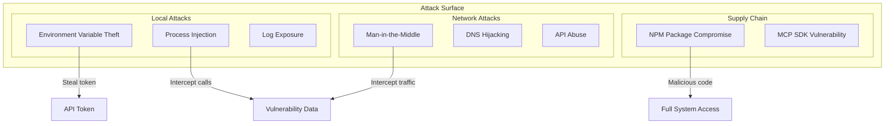
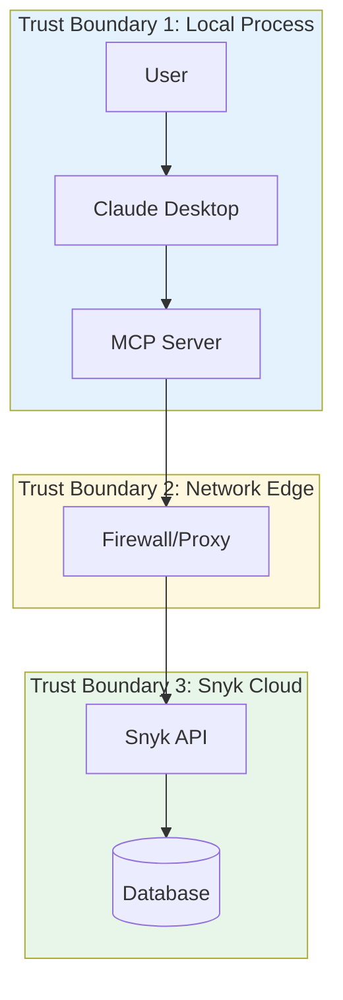
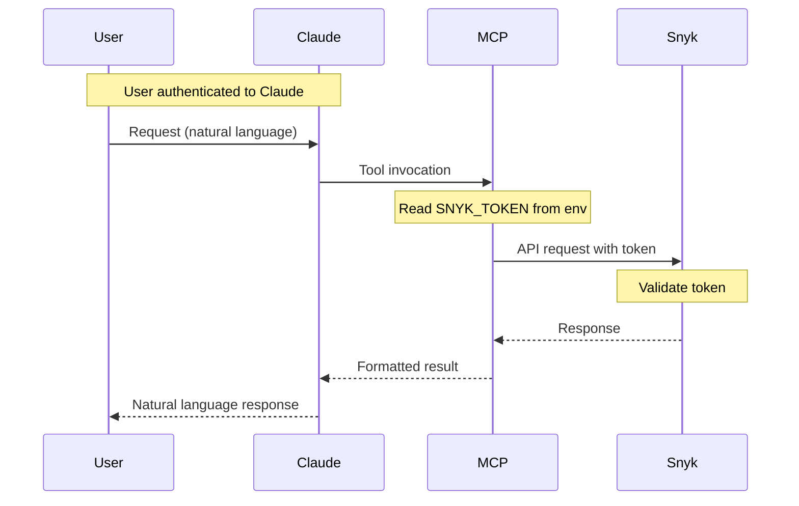

# Security Architecture

## Overview

This document provides a comprehensive security analysis of the Snyk MCP Server, including threat modeling, security controls, and recommendations for hardening.

## Threat Model

### Assets

| Asset | Value | Location | Protection Priority |
|-------|-------|----------|---------------------|
| Snyk API Token | High | Environment variable | Critical |
| Vulnerability Data | High | API responses | High |
| SBOM Data | Medium | API responses | Medium |
| Organization Structure | Medium | API responses | Medium |
| Project Metadata | Low | API responses | Low |

### Adversaries

| Adversary | Motivation | Capability | Likelihood |
|-----------|------------|------------|------------|
| External Attacker | Data theft, reconnaissance | High | Medium |
| Malicious Insider | Data exfiltration | Medium | Low |
| Compromised Dependency | Supply chain attack | High | Low |
| Misconfigured System | Accidental exposure | N/A | Medium |

### Attack Surface



### Threat Scenarios

#### T1: API Token Exposure

| Attribute | Value |
|-----------|-------|
| Threat | API token leaked via logs, config files, or error messages |
| Impact | Full access to Snyk organization |
| Likelihood | Medium |
| STRIDE | Information Disclosure |

**Mitigations**:
- Token stored in environment variable, not code
- Token not logged to stdout/stderr
- Token not included in error responses

#### T2: Man-in-the-Middle Attack

| Attribute | Value |
|-----------|-------|
| Threat | Attacker intercepts API traffic |
| Impact | Token theft, data exposure |
| Likelihood | Low |
| STRIDE | Information Disclosure, Tampering |

**Mitigations**:
- HTTPS enforced for all API calls
- TLS 1.2+ required
- Certificate validation (Axios default)

#### T3: Dependency Vulnerability

| Attribute | Value |
|-----------|-------|
| Threat | Vulnerability in axios or MCP SDK |
| Impact | Remote code execution, data theft |
| Likelihood | Low |
| STRIDE | Elevation of Privilege |

**Mitigations**:
- Minimal dependencies (2 runtime)
- Regular dependency updates
- npm audit for known vulnerabilities

#### T4: Unauthorized API Access

| Attribute | Value |
|-----------|-------|
| Threat | Attacker obtains valid token and abuses API |
| Impact | Data exfiltration, configuration changes |
| Likelihood | Low |
| STRIDE | Elevation of Privilege, Information Disclosure |

**Mitigations**:
- Token-based authentication
- Snyk API rate limiting
- Audit logging on Snyk side

## Trust Boundaries



### Boundary Controls

| Boundary | Inbound Controls | Outbound Controls |
|----------|------------------|-------------------|
| TB1 (Local) | Process isolation, user permissions | Token validation |
| TB2 (Network) | Firewall rules, proxy | TLS, certificate validation |
| TB3 (Snyk) | Token authentication, rate limiting | API response validation |

## Authentication and Authorization

### Authentication Flow



### Authorization Model

| Level | Mechanism | Scope |
|-------|-----------|-------|
| User | Claude authentication | Access to AI assistant |
| MCP | Token presence | Server startup |
| Snyk | Token validation | API access |
| Organization | Token permissions | Org-level resources |

### Token Permissions

The Snyk API token determines accessible resources:

| Permission | Operations Enabled |
|------------|-------------------|
| Read | List orgs, projects, issues, targets |
| Write | Ignore issues, activate/deactivate projects |
| Admin | Organization entitlements |

## Data Security

### Data Classification

| Category | Examples | Controls |
|----------|----------|----------|
| Secret | API Token | Env var, never log, TLS |
| Confidential | Vulnerabilities, SBOM | TLS, access control |
| Internal | Org structure, project names | TLS |
| Public | API version, tool names | None required |

### Encryption

| State | Encryption | Standard |
|-------|------------|----------|
| In Transit | Yes | TLS 1.2+ |
| At Rest | No (memory only) | N/A |
| In Process | No | N/A |

### Data Handling

| Data Type | Retention | Disposal |
|-----------|-----------|----------|
| API Token | Process lifetime | Process termination |
| Responses | Request scope | Garbage collection |
| Errors | Transient | stderr flush |

## Supply Chain Security

### Dependency Analysis

| Dependency | Version | Known Vulnerabilities | Risk |
|------------|---------|----------------------|------|
| @modelcontextprotocol/sdk | ^1.0.0 | Check npm audit | Medium |
| axios | ^1.6.0 | Check npm audit | Medium |
| @types/node | ^20.10.0 | Dev only | Low |
| typescript | ^5.3.0 | Dev only | Low |

### Supply Chain Controls

| Control | Status | Recommendation |
|---------|--------|----------------|
| Lock file | Yes (package-lock.json) | Commit to repo |
| npm audit | Manual | Add to CI/CD |
| Dependabot | Not configured | Enable on GitHub |
| SBOM | Not generated | Add npm sbom step |

## Security Controls Matrix

### Implemented Controls

| Control | Category | Implementation |
|---------|----------|----------------|
| Token-based auth | AuthN | Environment variable |
| TLS encryption | Confidentiality | HTTPS for all API calls |
| Input validation | Integrity | JSON schema in tool definitions |
| Error handling | Availability | Try-catch with formatted errors |
| Minimal privileges | Authorization | Read-focused operations |

### Missing Controls

| Control | Category | Risk | Recommendation |
|---------|----------|------|----------------|
| Rate limiting | Availability | Medium | Implement client-side throttling |
| Request timeout | Availability | Medium | Configure axios timeout |
| Retry with backoff | Availability | Low | Implement for transient errors |
| Audit logging | Non-repudiation | Medium | Add structured logging |
| Input sanitization | Integrity | Low | Validate tool arguments |
| Secrets rotation | Security | Medium | Document rotation process |

## Hardening Recommendations

### Immediate (Priority 1)

1. **Add Request Timeout**
```typescript
axios.create({
  ...config,
  timeout: 30000, // 30 second timeout
});
```

2. **Validate Token Format**
```typescript
if (!SNYK_TOKEN?.match(/^[a-f0-9-]+$/)) {
  throw new Error("Invalid token format");
}
```

3. **Add Security Headers**
```typescript
headers: {
  ...existing,
  "X-Snyk-Client": "snyk-mcp/1.0.0",
}
```

### Short-term (Priority 2)

4. **Implement Rate Limiting**
```typescript
const rateLimiter = new RateLimiter({
  tokensPerInterval: 100,
  interval: "minute"
});
```

5. **Add Audit Logging**
```typescript
function auditLog(tool: string, orgId: string) {
  console.error(JSON.stringify({
    timestamp: new Date().toISOString(),
    tool,
    orgId,
    level: "audit"
  }));
}
```

6. **Configure npm Audit in CI**
```yaml
- name: Security audit
  run: npm audit --audit-level=high
```

### Long-term (Priority 3)

7. **Implement Secrets Management**
   - Support for HashiCorp Vault
   - Support for AWS Secrets Manager
   - Support for 1Password CLI

8. **Add SBOM Generation**
```bash
npm sbom --format cyclonedx > sbom.json
```

9. **Container Security Scanning**
   - If Docker deployment is added
   - Scan base images and dependencies

## Incident Response

### Token Compromise Procedure

1. **Immediate**: Revoke token in Snyk console
2. **Generate**: Create new token
3. **Update**: Update environment/config
4. **Audit**: Review Snyk audit logs for unauthorized access
5. **Monitor**: Watch for suspicious activity

### Vulnerability Discovery Procedure

1. **Assess**: Determine severity and exploitability
2. **Patch**: Update affected dependency
3. **Test**: Verify fix doesn't break functionality
4. **Deploy**: Roll out updated version
5. **Document**: Record in security changelog

## Compliance Considerations

| Standard | Relevance | Status |
|----------|-----------|--------|
| SBOM Export | CycloneDX/SPDX support | Implemented |
| PII Handling | User email in verify_token | Minimal |
| Data Retention | No persistence | Compliant |
| Encryption in Transit | TLS enforced | Compliant |

## Security Testing

### Recommended Tests

| Test Type | Scope | Frequency |
|-----------|-------|-----------|
| npm audit | Dependencies | Every build |
| SAST | Source code | Every PR |
| Secrets scanning | Repo | Every commit |
| Dependency review | package.json | Monthly |

### Test Commands

```bash
# Dependency vulnerabilities
npm audit

# Check for secrets in code
git secrets --scan

# Generate SBOM
npm sbom --format cyclonedx
```

## Open Questions and Gaps

1. **Multi-factor Auth**: Token is single factor; no MFA support
2. **Token Rotation**: No automated rotation mechanism
3. **Audit Trail**: No local audit logging
4. **Secret Detection**: No pre-commit hooks for secret detection
5. **SBOM for MCP**: Self-SBOM not generated or published
6. **Penetration Testing**: No formal security testing documented
7. **Security Response**: No SECURITY.md or vulnerability disclosure policy
