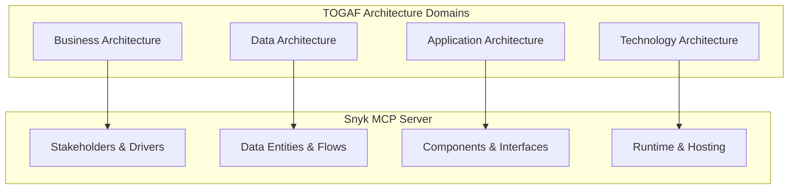
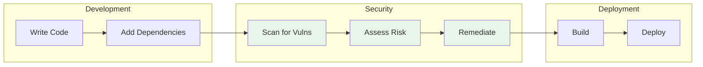
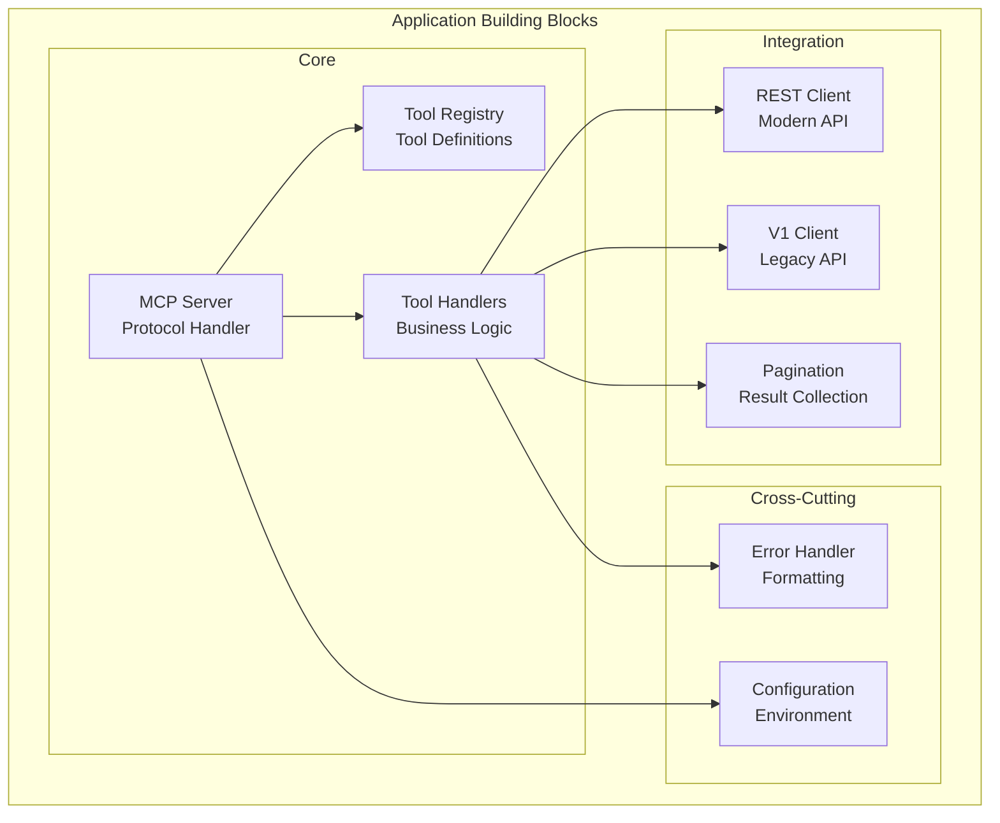
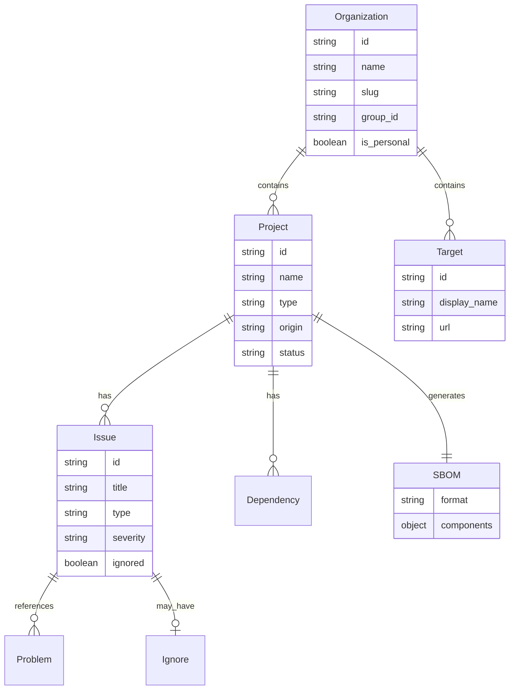
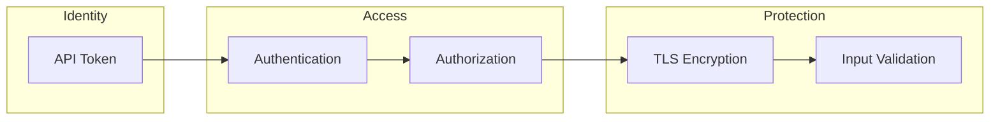
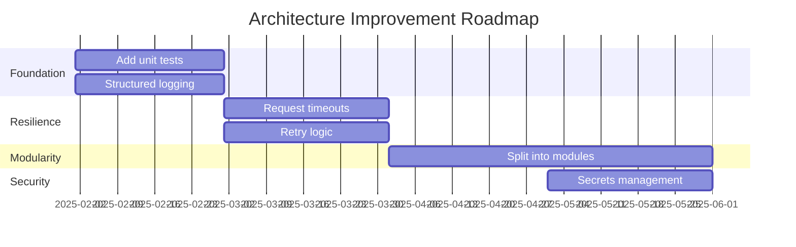

# TOGAF Architecture Mapping

## Overview

This document maps the Snyk MCP Server architecture to TOGAF (The Open Group Architecture Framework) domains and provides enterprise architecture views aligned with TOGAF principles.

## TOGAF Domain Mapping



## Business Architecture

### Stakeholders

| Stakeholder | Role | Concerns | Influence |
|-------------|------|----------|-----------|
| Developer | Primary User | Fast vulnerability lookup | High |
| Security Engineer | Primary User | Comprehensive security view | High |
| DevSecOps Lead | Decision Maker | Automation, integration | High |
| Platform Team | Operations | Stability, maintenance | Medium |
| CISO | Sponsor | Risk reduction, compliance | Medium |

### Business Drivers

| Driver | Description | Alignment |
|--------|-------------|-----------|
| Shift-Left Security | Enable developers to find vulnerabilities earlier | Direct |
| AI-Assisted Development | Leverage AI for productivity | Direct |
| Security Automation | Reduce manual security tasks | Indirect |
| Compliance | Meet security standards | Indirect |

### Business Capabilities

| Capability | Description | MCP Support |
|------------|-------------|-------------|
| Vulnerability Management | Identify and track vulnerabilities | Full |
| Dependency Analysis | Understand software composition | Full |
| SBOM Generation | Produce software bill of materials | Full |
| Risk Assessment | Evaluate security risk | Partial |
| Remediation Tracking | Track fix progress | Partial |

### Value Stream



**MCP Contribution**: Enables natural language access to the Security phase activities.

### Business Constraints

| Constraint | Impact | Mitigation |
|------------|--------|------------|
| Snyk subscription required | Licensing cost | Align with existing Snyk usage |
| API rate limits | Throughput ceiling | Batch operations, caching |
| Token management | Operational overhead | Document rotation process |

## Application Architecture

### Application Building Blocks



### Service Contracts

#### MCP Protocol Contract

| Aspect | Specification |
|--------|--------------|
| Protocol | Model Context Protocol (JSON-RPC 2.0) |
| Transport | stdio (stdin/stdout) |
| Operations | ListTools, CallTool |
| Schema | Tool input schemas (JSON Schema) |

#### Snyk REST API Contract

| Aspect | Specification |
|--------|--------------|
| Protocol | HTTPS REST |
| Base URL | https://api.snyk.io/rest |
| Auth | Bearer token |
| Version | 2024-10-15 (query param) |
| Content-Type | application/vnd.api+json |

#### Snyk V1 API Contract

| Aspect | Specification |
|--------|--------------|
| Protocol | HTTPS REST |
| Base URL | https://api.snyk.io/v1 |
| Auth | Token header |
| Content-Type | application/json |

### Interface Catalog

| Interface | Type | Direction | Consumer/Provider |
|-----------|------|-----------|-------------------|
| MCP Tools | API | Inbound | AI Assistant (Consumer) |
| REST API | HTTP | Outbound | Snyk Platform (Provider) |
| V1 API | HTTP | Outbound | Snyk Platform (Provider) |
| Environment | Config | Inbound | OS (Provider) |
| stderr | Log | Outbound | Console (Consumer) |

### Application Interaction Matrix

| Consumer \ Provider | MCP Host | REST API | V1 API |
|---------------------|----------|----------|--------|
| MCP Server | Reads requests | Sends queries | Sends queries |
| Tool Handlers | N/A | Calls endpoints | Calls endpoints |
| Error Handler | N/A | Parses errors | Parses errors |

## Data Architecture

### Data Entities



### Data Classification

| Entity | Classification | Retention | Access |
|--------|---------------|-----------|--------|
| Organization | Internal | Snyk cloud | Token-based |
| Project | Internal | Snyk cloud | Token-based |
| Issue | Confidential | Snyk cloud | Token-based |
| SBOM | Confidential | Generated on-demand | Token-based |
| API Token | Secret | Env var only | Process-only |

### Data Flow Principles

| Principle | Implementation |
|-----------|---------------|
| Data minimization | Only request needed fields |
| Ephemeral storage | No local persistence |
| Secure transport | TLS for all API calls |
| Access control | Token-based authorization |

### Data Quality

| Aspect | Approach |
|--------|----------|
| Accuracy | Direct from Snyk source of truth |
| Timeliness | Real-time API queries |
| Completeness | Pagination for full results |
| Consistency | Single source (Snyk) |

## Technology Architecture

### Technology Stack

```mermaid
flowchart TB
    subgraph runtime["Runtime Layer"]
        node[Node.js 18+]
    end

    subgraph application["Application Layer"]
        typescript[TypeScript 5.3+]
        mcp_sdk[@modelcontextprotocol/sdk]
        axios[Axios]
    end

    subgraph os["OS Layer"]
        macos[macOS]
        linux[Linux]
        windows[Windows]
    end

    subgraph network["Network Layer"]
        https[HTTPS/TLS 1.2+]
    end

    typescript --> node
    mcp_sdk --> node
    axios --> node
    node --> macos
    node --> linux
    node --> windows
    axios --> https
```

### Platform Services

| Service | Provider | Purpose |
|---------|----------|---------|
| Runtime | Node.js | JavaScript execution |
| Package Manager | npm | Dependency management |
| Transport | stdio | IPC communication |
| Networking | OS TCP/IP | HTTP client |
| TLS | OpenSSL (via Node.js) | Encryption |

### Infrastructure Requirements

| Requirement | Specification |
|-------------|--------------|
| OS | macOS, Linux, Windows |
| Node.js | 18.0.0+ |
| Memory | 128MB minimum |
| Network | Outbound HTTPS to api.snyk.io |
| Storage | 50MB (including node_modules) |

### Technology Standards

| Standard | Usage |
|----------|-------|
| ES2022 | JavaScript language level |
| ESM | Module system |
| JSON Schema | Tool input validation |
| JSON-RPC 2.0 | MCP protocol |
| JSON:API | Snyk REST API format |

## Security Architecture

### Security Patterns

| Pattern | Implementation |
|---------|----------------|
| Defense in Depth | Multiple trust boundaries |
| Least Privilege | Read-heavy operations |
| Secure by Default | HTTPS enforced |
| Fail Secure | Error handling without data leaks |

### Security Policies

| Policy | Enforcement |
|--------|-------------|
| Authentication | Token required for all API calls |
| Authorization | Token scope determines access |
| Encryption | TLS for all network traffic |
| Secrets Management | Environment variables only |

### Security Building Blocks



## Architecture Principles

| Principle | Rationale | Implications |
|-----------|-----------|--------------|
| Stateless Design | Simplicity, reliability | No local state management |
| Single Responsibility | Maintainability | Each handler does one thing |
| Minimal Dependencies | Security, reliability | Only 2 runtime dependencies |
| Fail Fast | Reliability | Validate early, error clearly |
| Secure Defaults | Security | HTTPS, token-based auth |

## Gap Analysis

### Current vs Target State

| Aspect | Current | Target | Gap |
|--------|---------|--------|-----|
| Modularity | Single file | Multi-module | Medium |
| Testing | None | Unit + Integration | High |
| Observability | stderr logs | Structured logging | Medium |
| Resilience | Basic error handling | Retry, circuit breaker | Medium |
| Documentation | README | Full architecture docs | Closing |

### Roadmap Recommendations



## Open Questions and Gaps

1. **Enterprise Integration**: No SSO or enterprise identity provider support
2. **Governance**: No centralized policy management
3. **Portfolio**: Single-purpose tool; no broader portfolio view
4. **Change Management**: No versioning strategy documented
5. **Service Level**: No SLA defined for response times
6. **Capacity Planning**: No baseline metrics for capacity planning
